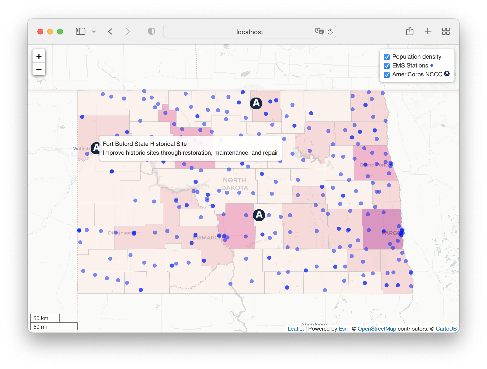

# leaflet-maps-open-data-apis
Leaflet map with multiple API data feeds Socrata and Esri ArcGIS Online. View [demo](https://handsondataviz.github.io/leaflet-maps-open-data-apis/index.html).



If you plan to query Socrata heavily, it is recommended you sign up for an API token. See more details at https://dev.socrata.com/.

### Example of data fetch from Socrata

*The original example showed hospital locations in North Dakota provided by Medicare.gov website. This example was modified on 23 March 2022 due to Medicare.gov replacing Socrata with a different database system. In this updated example, AmeriCorps NCCC projects in North Dakota are shown.*

Assuming you have your `map` initialized and layers control created, load data from a JSON endpoint in Socrata and add it to the map, using custom icons for markers.

```javascript
    $.getJSON("https://github.com/Linbing1065/leaflet-maps-open-data-apis/blob/main/guangdong.geojson?stabbr=ND", function(data) {

      // Array of markers
      var markers = [];
      
      // For each row in Socrata, create a marker
      for (var i = 0; i < data.length; i++) {
        
        var item = data[i];
    
        // Extract coordinates, convert strings to floats
        var coordinates = [
          parseFloat(item.geocoded_column.latitude),
          parseFloat(item.geocoded_column.longitude)
        ]

        // Create a marker with a custom icon
        var marker = L.marker(coordinates, {
            icon: L.icon({
              iconUrl: 'images/americorps.png',
              iconSize: [24, 24],
              iconAnchor: [12, 12],
              opacity: 0.5
            })
        }).bindTooltip(item.sponsor + '<br>' + item.project_description);

        // Add marker to the array of markers
        markers.push(marker);
      }

      // Create a Leaflet layer group from array of markers
      var layer = L.layerGroup(markers);
      layer.addTo(map); // add layer to the map

      // Add layer to the legend, together with the little icon
      legend.addOverlay(layer, 'AmeriCorps NCCC ')

    })
```

### Example of data load using esri-leaflet plugin

Esri-leaflet plugin allows you to load the data without using jQuery's `getJSON()` function.
You can add point-level data to the map as shown below:

```javascript
var ems = L.esri.featureLayer({
  url: 'https://services1.arcgis.com/Hp6G80Pky0om7QvQ/arcgis/rest/services/Emergency_Medical_Service_(EMS)_Stations_gdb/FeatureServer/0/',
  where: "STATE = 'ND'",
  pointToLayer: function(feature, latlng) {
    return L.circleMarker(latlng, {
      radius: 4,
      fillColor: 'blue',
      color: 'blue',
      weight: 0.1,
      opacity: 1,
      fillOpacity: 0.5,
      pane: 'markerPane'  // to make sure points stay above polygons and remain clickable
    }).bindTooltip(feature.properties.NAME)
  }
}).addTo(map)
```

## Learn more

- [Pull Open Data into Leaflet Map with APIs Tutorial](https://handsondataviz.org/leaflet-maps-open-apis.html) in *Hands-On Data Visualization* book (https://HandsOnDataViz.org)
- Leaflet-esri example (https://github.com/jackdougherty/leaflet-esri) by Jack Dougherty
- Tim Stallmann, Mapping external GeoJSON data, https://www.savaslabs.com/blog/mapping-external-geojson-data

## Credits
* Leaflet ([see license](https://github.com/Leaflet/Leaflet/blob/master/LICENSE))
* Esri Leaflet plugin (Apache 2.0)
* jQuery (MIT)
